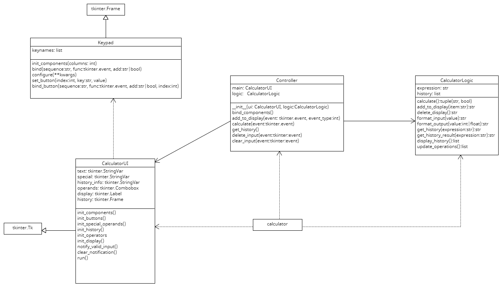

# calculator
A calculator with a tkinter GUI

### Associated files

| File                  | Description                          |
|-----------------------|--------------------------------------|
| calculator.py         | file to run the calculator           |
| calculator_ui         | GUI for the calculator               |
| calculator_controller | controller for the calculator        |
| calculator_model      | logic for the calculator to function |

### how to run
```
python calculator.py
```
UML diagram for the calculator


